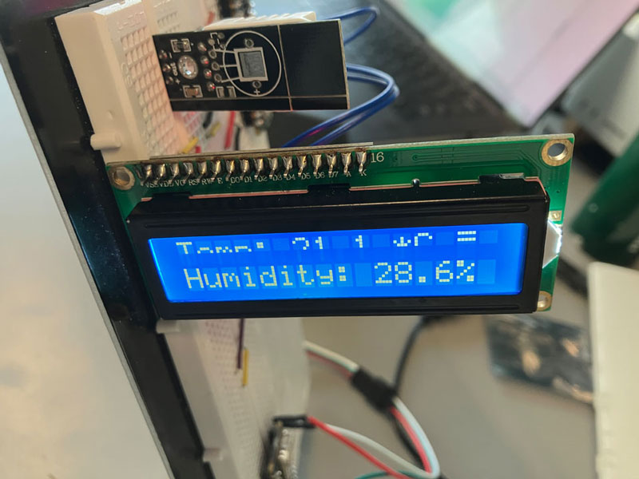
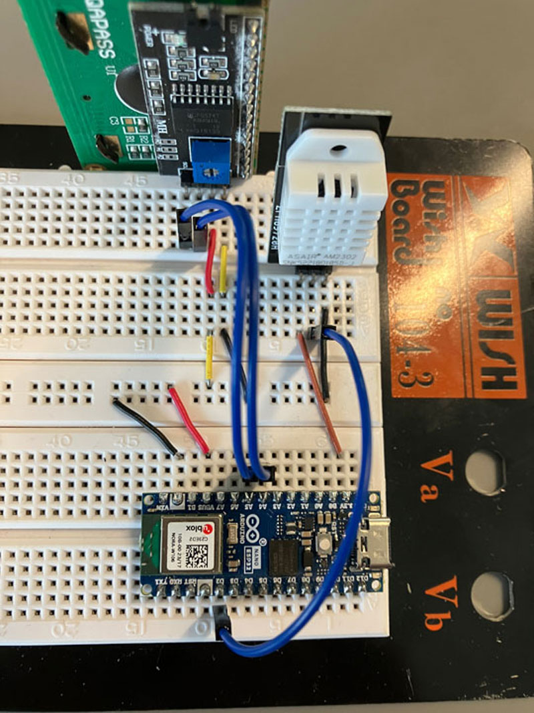

# Demo of Arduino Nano ESP32 in CircuitPython with OOCSI, DHT sensor, and 1602A LCD modules

 

## Hardware

* Arduino Nano ESP32
* 1602A LCD module
* DHT22 module

 

## What's on LCD display

It shows the temperature and humidity value returned by the DHT22 module.  
But the lower part of first line is defected, so the first line only has upper part working.

 

## Wiring

| 1602A LCD  |  Arduino Nano ESP32 | DHT22 |
| --- | --- | --- |
| SDA | A4 pin | |
| SCL | A5 pin | |
| GND | GND | - |
| VCC | 5V / VBUS | |
|| 3.3V | + |
|| D2 pin | out |

