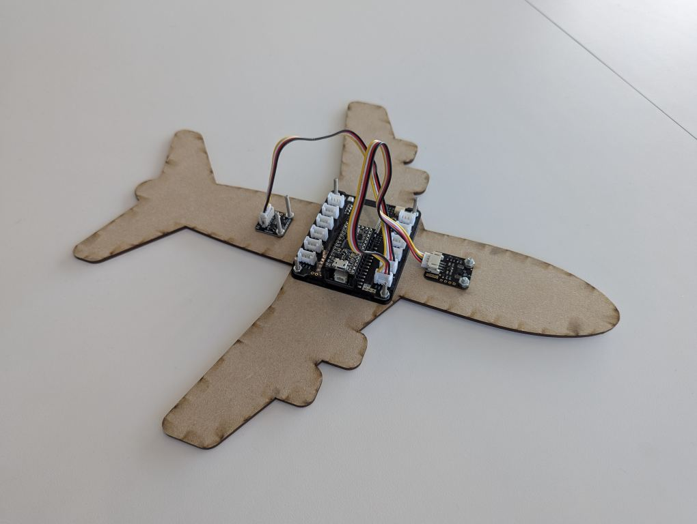
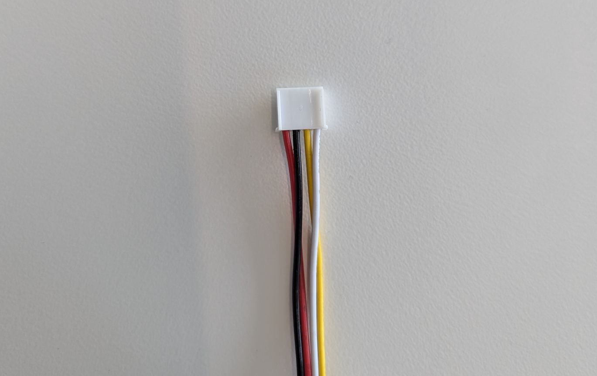

# CIK - Plane
This is an example of using OOCSI on the Connected Interaction Kit running CircuitPython. It consists of a array of sensors sending OOCSI messages on acceleration and height to the `circuitpython/plane/controller` oocsi channel.

## Hardware

* Connected Interaction Kit Bitsy + Expander
* Connected Interaction Kit TOF sensor (vl53l0x based)
* [DFRobot BMI160](https://wiki.dfrobot.com/Gravity__BMI160_6-Axis_Inertial_Motion_Sensor_SKU__SEN0250) available at [Tinytronics](https://www.tinytronics.nl/en/sensors/acceleration-rotation/dfrobot-gravity-bmi160-6-axis-inertial-motion-sensor)

## Wiring
> [!CAUTION]
> The DFROBOT BMI160 sensor uses a gravity port which is form factor compatible with the grove port **BUT DOES NOT** have the same pinout! This can be easily overcome by swapping the position of the Ground and Positive lead and the Data and clock lead on ONE side of the cable.

The following table shows to which sensor is connected what port on the board, however as both sensors are using I2C this does not really matter.

|  |  CIK sensor port |
| --- | --- |
| DFRobot BMI160  | I2C port 1 |
| TOF Sensor | I2C port 2 |

## Lasercut
The plane also comes with an (Editable) PDF file of a plane used for lasercutting the chasis. Here is the colourmapping used:

| Color |Action|
| --- | --- |
| Blue  | Cut lines |
| Red | Vector Marking |
