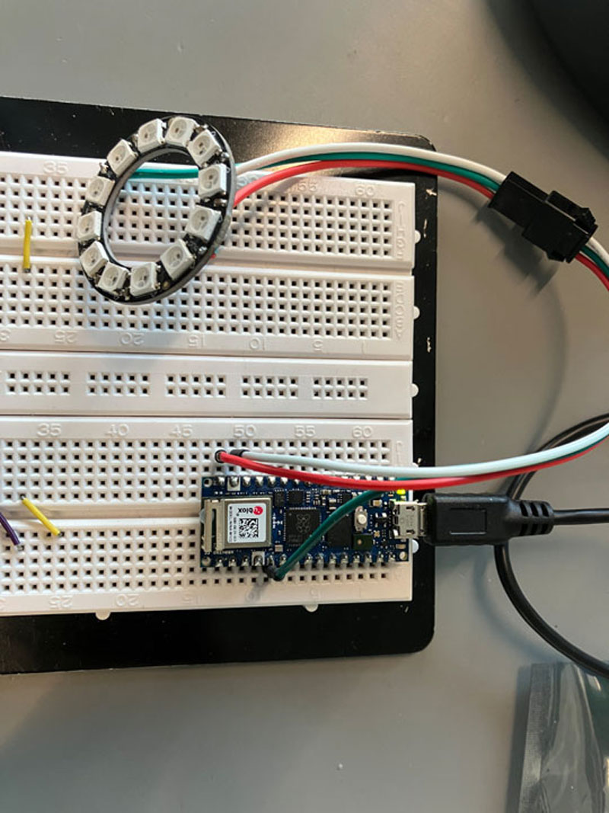

# Demo of Arduino Nano RP2040 Connect in CircuitPython with OOCSI and Adafruit LED ring module

This prototyping connects to the Internet with [Adafruit_CircuitPython_ESP32SPI library](https://github.com/adafruit/Adafruit_CircuitPython_ESP32SPI), and interacts with the height data sending via the plane ptototyping by lighting up the LED ring in different colors.

 

## Hardware

* Arduino Nano RP2040 Connect
* Adafruit LED ring module (12 leds)

 

## Wiring

| Adafruit LED ring  |  Arduino Nano RP2040 Connect |
| --- | --- |
| Data Input | D2 pin |
| 5V DC Power | Vin |
| GND | GND |

